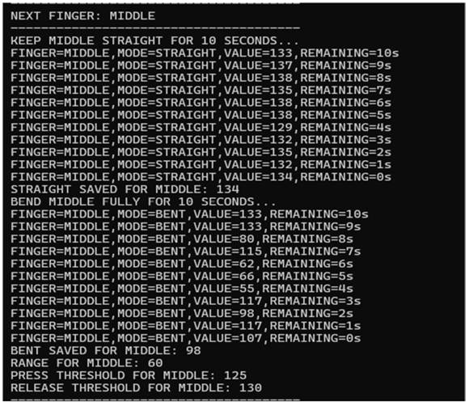
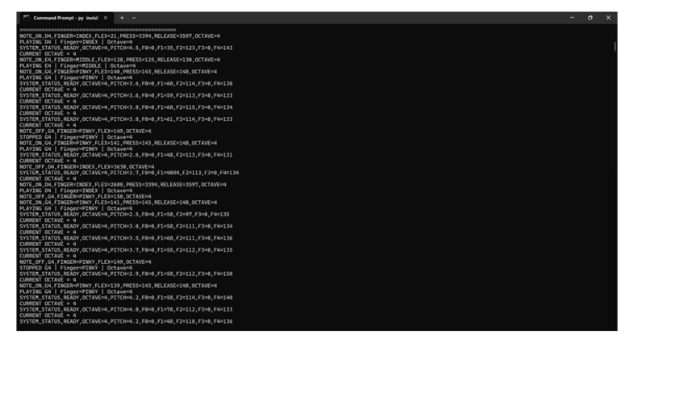
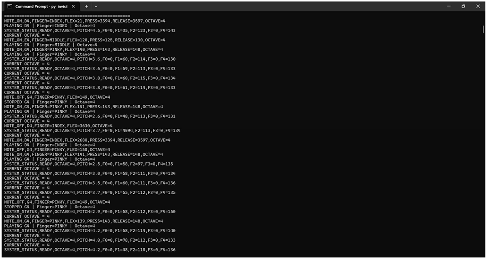

# 🎹 VibePiano Glove

## Gesture-Based Air Piano System Using ESP32

VibePiano Glove is a wearable gesture-based musical interface that converts finger movements into piano notes without requiring a physical piano keyboard.

The system uses five flex sensors for individual finger note detection and an MPU6050 IMU for wrist motion control. The flex sensors mounted on the fingers detect bending movements, while the ESP32 processes the sensor data in real time. The detected musical notes are transmitted to a Python-based sound engine for audio playback. Vibration motors provide haptic feedback corresponding to finger activation.

---

## 📌 Project Overview

VibePiano Glove combines wearable sensing, embedded systems, gesture recognition, musical interaction, and haptic feedback into a single wearable interface.

The system consists of:

- Five flex sensors for individual finger-bend detection
- MPU6050 accelerometer and gyroscope for wrist motion
- ESP32 microcontroller for real-time processing
- Vibration motors for tactile feedback
- Serial communication between ESP32 and computer
- Python-based sound engine for piano audio playback
- Automatic sensor calibration

The five fingers are mapped to the musical notes C, D, E, F, and G.

---

## ✨ Features

- 🎹 Five-finger piano note generation
- ✋ Real-time finger bend detection
- 🎚️ Automatic flex sensor calibration
- 🧭 Wrist orientation detection using MPU6050
- 🎼 Wrist-based octave switching
- 📳 Proportional haptic feedback
- ⚡ ESP32-based real-time processing
- 💻 Python-based audio playback
- 🔄 Serial communication
- 🧤 Wearable glove-based musical interface

---

## 🔧 Hardware Used

| Component | Quantity | Purpose |
|---|---:|---|
| ESP32 | 1 | Main microcontroller and processing unit |
| Flex Sensors | 5 | Finger bend detection |
| MPU6050 IMU | 1 | Wrist motion and orientation detection |
| Vibration Motors | 5 | Haptic feedback |
| Glove | 1 | Wearable platform |
| Connecting Wires | - | Electrical connections |

---

## 🎯 Finger-to-Note Mapping

Each finger is assigned to a different piano note.

| Finger | Piano Note |
|---|---|
| Thumb | C |
| Index Finger | D |
| Middle Finger | E |
| Ring Finger | F |
| Pinky Finger | G |

The basic note mapping is:

Thumb → C  
Index → D  
Middle → E  
Ring → F  
Pinky → G

The system can generate notes in different octaves depending on wrist orientation.

---

## 🎼 Octave Control

The MPU6050 is used to detect wrist orientation and control the selected octave.

| Wrist Position | Selected Octave |
|---|---|
| Neutral | Octave 4 |
| Wrist tilted upward | Octave 5 |
| Wrist tilted downward | Octave 3 |

This allows the user to change the octave using wrist movement instead of physical buttons.

---

## 🧭 Wrist Motion Control

The MPU6050 provides accelerometer and gyroscope measurements for detecting wrist orientation.

The wrist movement can be used for:

- Octave shifting
- Wrist orientation detection
- Additional expressive musical control

This allows the glove to provide more interaction than simple finger-triggered notes.

---

## ⚙️ System Architecture

The overall system follows the sequence:

Flex Sensors  
↓  
Finger Bend Detection  
↓  
ESP32 Processing  
↓  
MPU6050 Wrist Orientation  
↓  
Note and Octave Determination  
↓  
Serial Communication  
↓  
Python Sound Engine  
↓  
Audio Output

At the same time:

ESP32  
↓  
Vibration Motors  
↓  
Haptic Feedback

---

## 🔌 Pin Configuration

### Flex Sensors

| Finger | ESP32 GPIO |
|---|---:|
| Thumb | GPIO 35 |
| Index | GPIO 36 |
| Middle | GPIO 34 |
| Ring | GPIO 32 |
| Pinky | GPIO 33 |

### Vibration Motors

| Finger | ESP32 GPIO |
|---|---:|
| Thumb | GPIO 25 |
| Index | GPIO 26 |
| Middle | GPIO 27 |
| Ring | GPIO 14 |
| Pinky | GPIO 13 |

### MPU6050

| MPU6050 Pin | ESP32 Pin |
|---|---|
| SDA | GPIO 21 |
| SCL | GPIO 22 |

---

## 🔄 Working Principle

### 1. Flex Sensor Calibration

The system first performs calibration for the flex sensors.

For every finger, the sensor values are obtained for different finger positions, including:

- Straight position
- Bent position

These values are used to determine the usable sensor range and detection thresholds.

---

### 2. Finger Bend Detection

The ESP32 continuously reads the analog values from the five flex sensors.

The measured sensor value is compared with the calibrated range.

The bend percentage is calculated and used to determine whether a finger has been activated.

---

### 3. Piano Note Detection

Once a finger is detected as activated, it is mapped to its corresponding piano note.

Thumb → C  
Index → D  
Middle → E  
Ring → F  
Pinky → G

---

### 4. Wrist Orientation Detection

The MPU6050 continuously measures wrist motion.

The wrist orientation is used to select the required octave.

Neutral position corresponds to octave 4, while upward and downward wrist movements are used for octave shifting.

---

### 5. Haptic Feedback

Each finger is associated with a vibration motor.

When a note is activated, the corresponding motor provides tactile feedback.

The system can vary the vibration intensity according to the detected finger bend.

This provides physical feedback to the user while playing.

---

### 6. Serial Communication

The ESP32 sends the detected note and relevant gesture information to the computer through serial communication.

The Python program receives this information and determines the corresponding audio file.

---

### 7. Audio Playback

The Python sound engine receives the note information from the ESP32 and plays the corresponding WAV audio file.

This produces the final piano sound.

---

## 🎚️ Sensor Calibration

Calibration is an important part of the system because flex sensor readings can vary between different fingers and users.

The calibration process determines:

- Straight sensor value
- Bent sensor value
- Bend range
- Activation threshold
- Release threshold

The calibrated values are then used during performance mode for reliable finger detection.

---

## 💻 Software Used

### ESP32 Firmware

The ESP32 side is developed using:

- Arduino IDE
- ESP32 Arduino Core
- C/C++
- Wire library
- Adafruit MPU6050 library
- Adafruit Sensor library

### Python Sound Engine

The computer-side program uses:

- Python 3
- PySerial
- WAV audio files
- Serial communication

---

## 🎵 Musical Operation

The five fingers generate the following notes:

Thumb → C  
Index → D  
Middle → E  
Ring → F  
Pinky → G

The wrist position changes the octave:

Downward Wrist → Octave 3  
Neutral Wrist → Octave 4  
Upward Wrist → Octave 5

This allows the user to play musical notes using both finger and wrist movements.

---

# 📊 Results

The developed VibePiano Glove prototype demonstrates a wearable gesture-based musical interface using flex sensors, an MPU6050 IMU, ESP32 processing, haptic feedback, serial communication, and computer-based audio playback.

The prototype demonstrates the complete interaction from finger movement detection to note generation and output.

---

## 🧤 Glove Hardware Prototype

The physical glove prototype integrates the five flex sensors, ESP32, MPU6050 and supporting connections.

---

## 🎹 Prototype With Live Output

The prototype demonstrates the glove system along with the corresponding live system output.

---

## 📐 Flex Sensor Calibration

The flex sensors are calibrated before performance operation so that the system can determine suitable values for straight and bent finger positions.

---

## 🎵 Note Detection Output

The detected finger movements are mapped to their corresponding piano notes.

---

## 💻 System Serial Output

The serial output provides information from the ESP32 during calibration and performance operation.

---

## 📈 Project Outcomes

The developed prototype demonstrates:

- Real-time finger movement detection
- Five-finger piano note mapping
- Wrist-based octave selection
- Flex sensor calibration
- MPU6050-based wrist detection
- ESP32 real-time processing
- Haptic feedback
- Serial communication
- Python-based audio playback
- Wearable gesture-based musical interaction

The project demonstrates the feasibility of using an ESP32-based wearable glove as a gesture-controlled musical interface.

The project implementation uses a responsive processing loop designed for real-time musical interaction.

---

## 🚀 Future Improvements

The system can be extended with the following improvements:

- Full piano keyboard support
- Dual-glove operation
- Additional gesture recognition
- Volume control using wrist movement
- Sustain pedal emulation
- Improved wearable construction
- Flexible PCB integration
- 3D-printed glove housing
- Wireless communication
- Mobile-based audio generation
- Machine-learning-based gesture recognition
- AR/VR integration
- Unity or Unreal Engine integration
- Improved power management

---

## 📁 Project Structure

VibePiano-Glove/

├── ESP32_Code/  
│   └── VibePiano_Glove.ino  
│  
├── Python_Code/  
│   ├── piano_sound_engine.py  
│   └── requirements.txt  
│  
├── Images/  
│   ├── glove_hardware_prototype.png  
│   ├── prototype_with_live_output.png  
│   ├── flex_sensor_calibration.png  
│   ├── note_detection_output.png  
│   └── system_serial_output.png  
│  
├── README.md  
│  
└── Vibe-Piano_document.pdf

---

## 🛠️ Technologies Used

- ESP32
- Arduino IDE
- C/C++
- Python
- PySerial
- MPU6050
- Flex Sensors
- Vibration Motors
- Serial Communication
- WAV Audio
- Embedded Systems
- Wearable Electronics

---

## 📚 Documentation

The complete project documentation is available in:

**Vibe-Piano_document.pdf**

The documentation contains:

- Project overview
- Literature survey
- Hardware implementation
- Software implementation
- Sensor calibration
- Finger-note mapping
- MPU6050 integration
- Haptic feedback
- Results
- Conclusion
- Future work
- References

---

## 👨‍💻 Project Information

**Project:** VibePiano Glove: Gesture-Based Air Piano System

**Platform:** ESP32

**Domain:** Embedded Systems / Wearable Electronics / Human-Machine Interface

**Academic Year:** 2025–2026

---

## ⭐ Project Highlights

> A wearable air-piano system that combines five flex sensors, an MPU6050 IMU, ESP32 processing, haptic feedback, and computer-based audio generation to transform finger and wrist movements into musical interaction.

---

## 📄 Project Documentation

For complete technical details, implementation, calibration procedure, experimental results, and references, refer to:

**Vibe-Piano_document.pdf**
