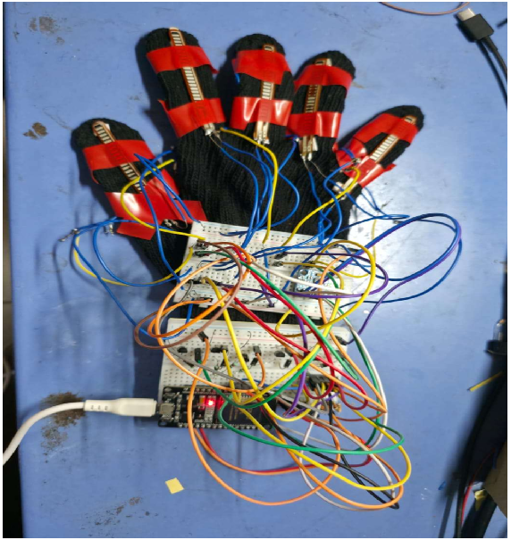
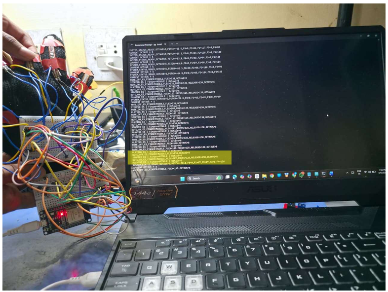

# 🎹 VibePiano Glove

## Gesture-Based Air Piano System Using ESP32

VibePiano Glove is a wearable gesture-based musical interface that converts finger movements into piano notes. The system uses five flex sensors to detect finger bending and an MPU6050 accelerometer/gyroscope to detect wrist orientation for octave selection.

An ESP32 performs real-time sensor processing and communicates the detected musical notes to a Python-based sound engine. Vibration motors provide haptic feedback when a finger gesture is detected.

---

## 📌 Project Overview

Traditional musical instruments require physical interaction with keys or strings. VibePiano Glove explores a wearable human-machine interface in which finger movements can be used to generate musical notes without a physical piano keyboard.

The system combines:

- Five flex sensors for finger-bend detection
- MPU6050 for wrist orientation detection
- ESP32 for real-time sensor processing
- Serial/Bluetooth communication
- Python-based piano sound generation
- Vibration motors for haptic feedback

---

## ✨ Features

- 🎹 Five-finger piano note generation
- 🖐️ Real-time finger bend detection
- 📐 Automatic flex sensor calibration
- 🧠 ESP32-based gesture processing
- 🧭 MPU6050-based wrist orientation detection
- 🎼 Wrist-based octave switching
- 📳 Haptic feedback using vibration motors
- 💻 Python-based audio playback
- ⚡ Real-time serial communication

---

## 🔧 Hardware Used

| Component | Quantity | Purpose |
|---|---:|---|
| ESP32 | 1 | Main microcontroller |
| Flex Sensor | 5 | Finger bend detection |
| MPU6050 | 1 | Wrist orientation detection |
| Vibration Motor | 5 | Haptic feedback |
| Glove | 1 | Wearable platform |
| External Power Supply | 1 | System power |

---

## 🎵 Finger-to-Note Mapping

Each finger is assigned a musical note.

| Finger | Note |
|---|---|
| Thumb | C |
| Index | D |
| Middle | E |
| Ring | F |
| Pinky | G |

The same five-note pattern is used across the supported octaves.

---

## 🎼 Octave Control

The MPU6050 is used to detect wrist orientation and select the octave.

| Wrist Position | Octave |
|---|---:|
| Downward Tilt | 3 |
| Neutral Position | 4 |
| Upward Tilt | 5 |

This allows the same finger gestures to generate notes in different octaves.

---

## ⚙️ System Architecture

```text
                 ┌─────────────────────┐
                 │    5 Flex Sensors   │
                 │    Finger Inputs    │
                 └──────────┬──────────┘
                            │
                            ▼
                 ┌─────────────────────┐
                 │        ESP32        │
                 │                     │
                 │ Sensor Processing   │
                 │ Gesture Detection   │
                 │ Note Generation     │
                 └───────┬───────┬─────┘
                         │       │
              ┌──────────┘       └──────────┐
              ▼                             ▼
     ┌─────────────────┐          ┌─────────────────┐
     │    MPU6050      │          │ Vibration       │
     │                 │          │ Motors          │
     │ Wrist / Octave  │          │ Haptic Feedback │
     │ Detection       │          │                 │
     └─────────────────┘          └─────────────────┘
                         │
                         │ Serial Communication
                         ▼
                 ┌─────────────────────┐
                 │ Python Sound Engine │
                 │                     │
                 │ Note Processing     │
                 │ WAV Playback        │
                 └──────────┬──────────┘
                            │
                            ▼
                     🎵 Piano Audio
---

## 📷 Prototype & Results

### Hardware Prototype

The VibePiano Glove prototype consists of five flex sensors mounted on the fingers, an ESP32 controller, MPU6050 and supporting circuitry.



---

### Prototype with Live Output

The prototype is shown operating with the computer displaying the real-time system output.



---

### Flex Sensor Calibration

The serial monitor displays the calibration process for individual fingers, including straight and bent sensor values, bend range, press threshold and release threshold.


---

### Note Detection Output

The serial output demonstrates real-time finger detection, note generation and octave information.


---

### System Serial Output

The serial monitor displays the detected notes, finger information, octave selection and system status during operation.


